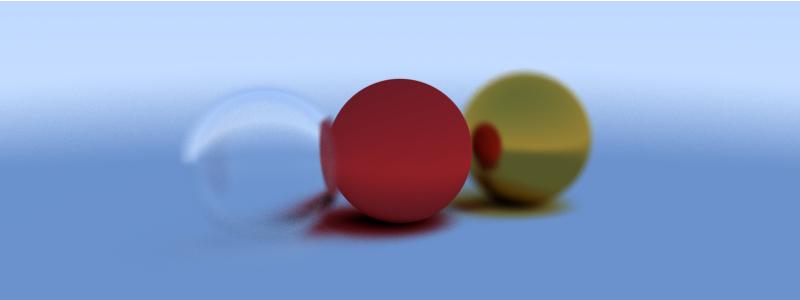

# 🌟 Raytracer



A fun little 3D raytracer written in Go that turns math into magic! Watch as simple geometric primitives become beautiful, photorealistic renders with reflections, refractions, and depth of field effects.

## 🎨 What Does It Do?

This raytracer simulates how light bounces around a 3D scene to create stunning images. It supports:

- **✨ Multiple Materials**: Matte surfaces, shiny metals, and crystal-clear glass
- **📸 Depth of Field**: Realistic camera blur effects 
- **🔮 Glass Refraction**: Light bending through transparent objects
- **⚡ Parallel Rendering**: Multi-core processing for faster renders
- **🎯 Clean Architecture**: Easy to understand and extend

## 🚀 Quick Start

### Build It
```bash
go build -o raytracer cmd/main.go
```

### Run It
```bash
./raytracer -o output.png
```

## 🛠 Development

### Run Tests
```bash
go test ./...
```

## 🏗 Architecture

The codebase is organized into clean, modular packages:

```
cmd/main.go           # CLI entry point with Cobra
internal/
├── render.go         # Main rendering pipeline
├── scene.go          # Scene setup and configuration
├── camera.go         # Camera with depth of field
├── geometry/
│   └── vector.go     # 3D vector math
├── ray.go            # Ray definitions
├── sphere.go         # Sphere primitives
└── materials/
    ├── diffuse.go    # Matte surfaces
    ├── metal.go      # Shiny reflective surfaces
    └── dielectric.go # Glass-like refraction
```

## 🎭 The Default Scene

The built-in scene features:
- A **red matte sphere** (left) - classic Lambertian diffuse material
- A **golden metal sphere** (right) - with a touch of fuzziness for realism
- A **glass sphere** (center) - with realistic refraction and a neat hollow effect
- A **large ground plane** - to catch all those beautiful shadows

## 🔧 Tech Stack

- **Go**: Fast, concurrent, and fun to write
- **Cobra**: Elegant CLI interface
- **Parallel Processing**: One goroutine per pixel row for speedy renders
- **Pure Go**: No external rendering dependencies, just math and creativity

## 🎯 Why This Exists

Sometimes you want to understand how light works. Sometimes you want to make pretty pictures. Sometimes you just want to write some Go code that does something visually cool. This project scratches all those itches!

## 📈 Performance

The raytracer uses Go's excellent concurrency features to render multiple pixel rows in parallel. On a modern multi-core machine, you'll see all your CPU cores happily crunching through rays and intersections.

## 🚀 Future Ideas

- More primitive types (planes, triangles, meshes)
- Texture mapping  
- Area lights and soft shadows
- More advanced materials (subsurface scattering, anyone?)
- Scene file format for custom scenes
- Progressive rendering with live preview

---

*Happy ray tracing! 🎨*
